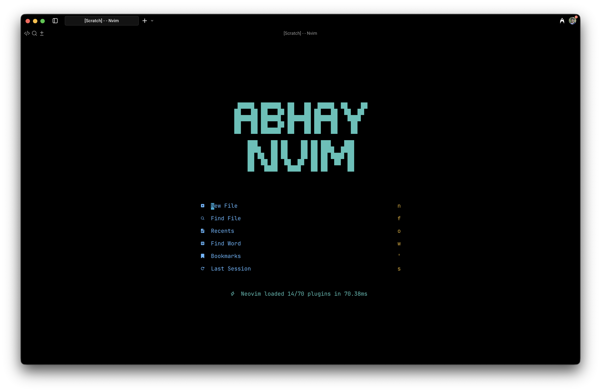
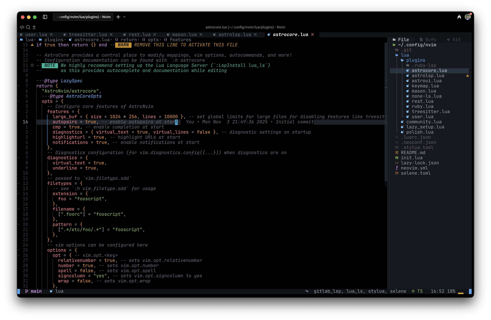

# Abhay Nvim

This is my personal Nvim config that I use as my daily driver.




## 🛠️ Installation

#### Make a backup of your current nvim and shared folder

```shell
mv ~/.config/nvim ~/.config/nvim.bak
mv ~/.local/share/nvim ~/.local/share/nvim.bak
mv ~/.local/state/nvim ~/.local/state/nvim.bak
mv ~/.cache/nvim ~/.cache/nvim.bak
```

#### Clone the repository

```shell
git clone https://github.com/AbhayVAshokan/abhay-nvim ~/.config/nvim
```
